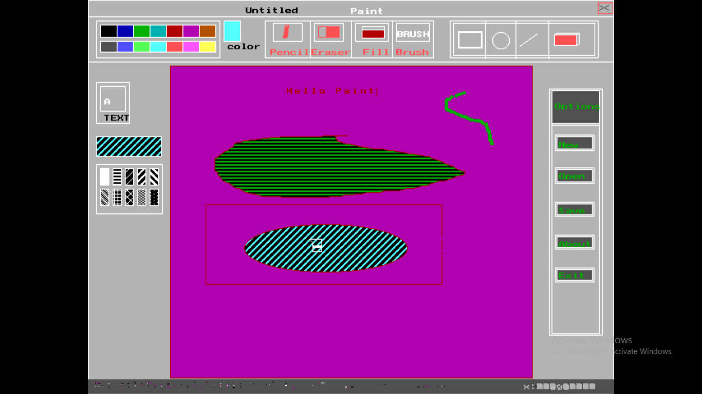
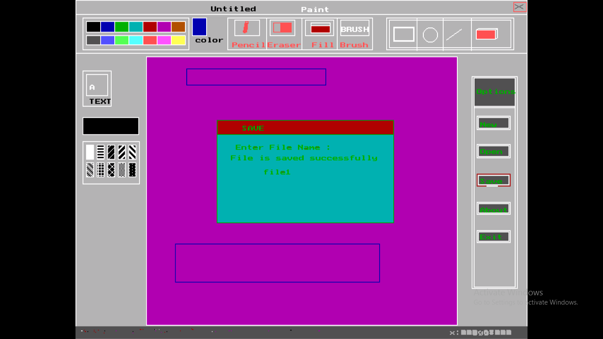
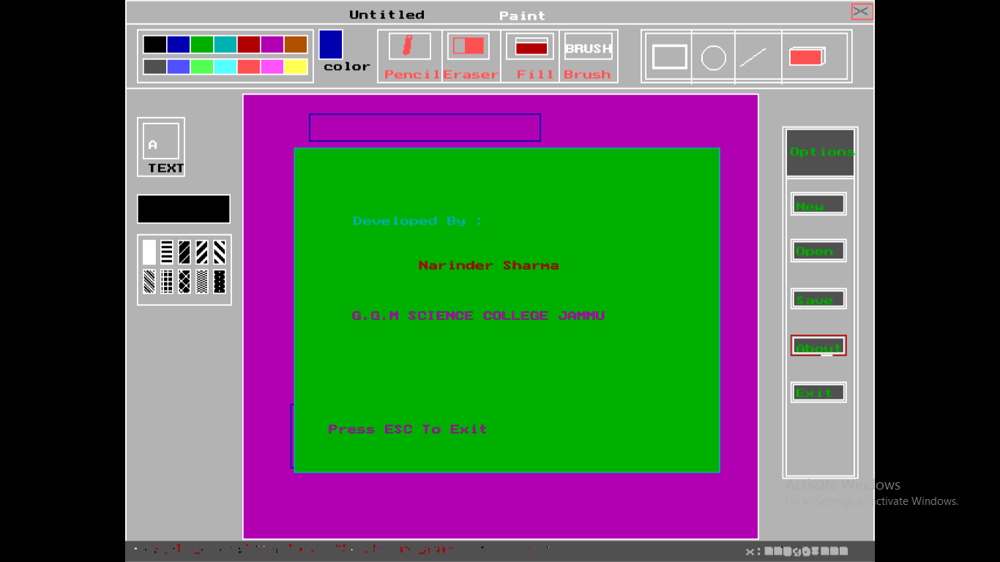

About The Project
 A module of MS PAINT developed in C programming language and BGI (Borland graphic interface). This module includes the basic features of MS PAINT like drawing 
Rectangles 
Circles 
lines 
Free-hand drawing
Filling of a area erasing a drawn shape
Saving and Opening Image 

Screenshots: 

